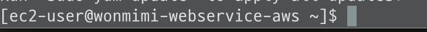
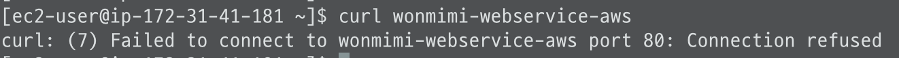
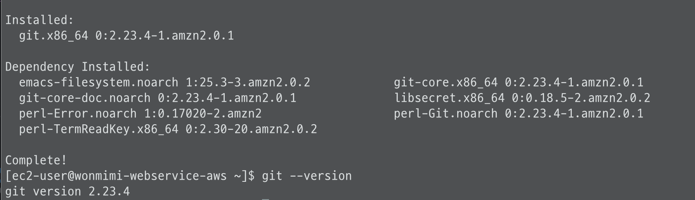
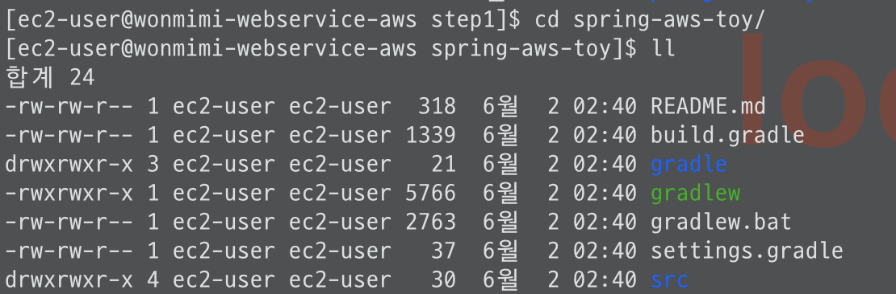
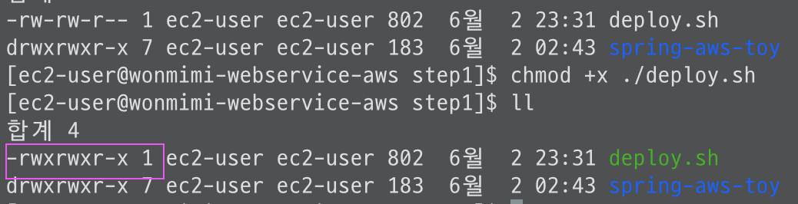
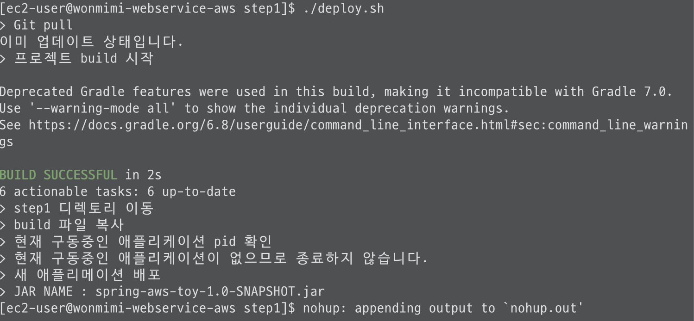
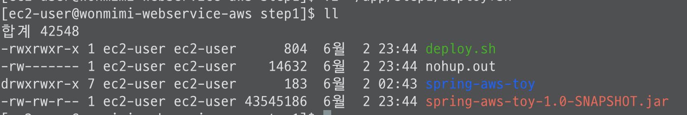
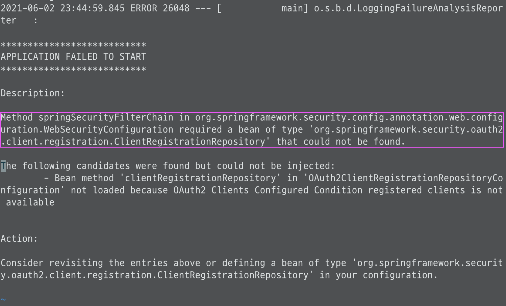
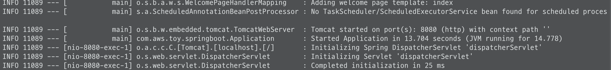

### 인스턴스 
- 생성중 보안그룹 추가 할때 ssh접속시 내 IP로 지정 (다른 장소 접속시, 해당장소의 IP ssh 규칙 추가 적용)
  * 생성한 pem키로 인스턴스 접근 (유출 조심)
- 인스턴스는 정지후 재시작 하면 ip 도 변동됨
- 고정 ip = Elastic IP (EIP, 탄련적 ip) 생성하여 연결해준다
  * 생성후 EC2에 바로 연결하지않으면 비용이 발생하므로 바로연결 
  * 사용할 인스턴스가 없을때에도 탄력적 IP를 삭제 해야한다 

#### 1. 로컬에서 EC2 서버 접속
pem 키 파일을 자동으로 읽을수 있도록 ~/.ssh/ 디렉토리로 이동 
```zsh
# .ssh 로 복사 
cp [pem파일 위치] ~/.ssh/

# pem키 권한 변경
chmod 600 ~/.ssh/키이름

# config 파일 수정 
vi ~/.ssh/config 

#  config 파일 내용 
  Host wonmimi-webservice-aws (원하는 서비스명)
  HostName 탄련적 IP
  User ec2-user
  IdentityFile ~/.ssh/pem키 이름


# config 권한 변경
chmod 700 ~/.ssh/config
```

EC2 접속
```zsh
ssh wonmimi-webservice-aws (config에 등록한 Host명)
```


접속 종료시
```zsh
  exit
```

#### 2. 아마존 리눅스 서버 생성시 필수 설정 
\+ 자바 기반 웹 애플리케이션
1) java설치 
  ```zsh
  # 자바 8 설치 
  sudo yum install -y java-1.8.0-openjdk-devel.x86_6
  # 자바 11인경우
  sudo amazon-linux-extras install java-openjdk11

  # 인스턴스 자바 버전 설정
  sudo /usr/sbin/alternatives --config java

  # 사용하지않는 버전이 있을경우 삭제 
  sudo yum remove java-1.7.0-openjdk (자바 버전)
  ```
2) 타임존 변경 
  ```zsh
    # 기본 UTC -> KST 변경
    sudo rm /etc/localtime
    sudo ln -s /usr/share/zoneinfo/Asia/Seoul /etc/localtime
  ```
3) 호스트네임 변경
```zsh
  # config 파일 수정
  sudu vim /etc/sysconfig/network

  #HOSTNAME 추가 (또는 변경)
  NETWORKING=yes
  NOZEROCONF=yes
  HOSTNAME=wonmimi-webservice-aws
```

 \** amazone ami2 인 경우, [참고](https://vkein.tistory.com/entry/%EC%95%84%EB%A7%88%EC%A1%B4-EC2-%EC%B4%88%EA%B8%B0-%EC%84%A4%EC%A0%95%ED%95%98%EA%B8%B0)
```zsh
  sudo hostnamectl set-hostname 등록할 호스트명
```
 서버 재부팅 (후 변경된 HOSTNAME 확인)
```zsh
  sudu reboot
```
  * 재접속 하여 hostname 확인 

  * /etc/hosts 에 hostname 등록
```zsh
  sudo vim /etc/hosts

  # hostname 작성
  127.0.0.1   localhost localhost.localdomain localhost4 localhost4.localdomain4
  ::1         localhost6 localhost6.localdomain6

  127.0.0.1       wonmimi-webservice-aws
```
  * 등록 확인 
  ```zsh
    curl wonmimi-webservice-aws (등록 HOSTNAME)
  ```
  * 80포트 접근에러가 뜨면 등록 OK
  

  ```zsh
  curl: (7) Failed to connect to wonmimi-webservice-aws port 80: Connection refused
  ```
  아직 80포트로 실행된 서비스가 없음. curl 포스트 실행은 OK

  #### 3-1. EC2 서버에 프로젝트 배포
  ec2에 깃 설치
  ```zsh
  sudo yum install git
  ```
  설치후 깃 버전 확인
  ```zsh
  git --version
  ```
  

  git clone 할 디렉토리 생성 후 이동
  ```zsh
    mkdir ~/app && mkdir ~/app/step1
    cd ~/app/step1
  ```
  클론할 저장소 https URl 복사 (\* 저장소 public 확인 )
  ```zsh
    git clone [저장소 url]
    #git clone https://github.com/wonmimi/spring-aws-toy.git

  복사된 저장소 이동
  cd [프로젝트명]
  # cd spring-aws-toy
  ```
  디렉토리 확인
  

  테스트 실행 
  ```zsh
    ./gradlew test 
  ```
  - gradlew Permission Denied 인 경우 권한 추가 후 테스트
    ```zsh
      # 권한 추가 
      chmod +x ./gradlew
    ```
  테스트 통과시, 
  

  - 테스트 실패하였을경우, 프로젝트 소스 수정후 깃푸시 => EC2에서 git pull 하여 다시 테스트 실행 

 \* EC2엔 gradle이 설치되어있지 않지만, wrapper파일인 gradlew이 gradle이을 쓸수있도록 지원해준다.(해당 프로젝트에 한해서)

 #### 3-2. 배포 스크립트 만들기
  다음 1)~3) 모두 포괄하는게 배포 
  1) git clone 또는 pull 하여 프로젝트를 받음
  2) gradle 또는 maven을 통해 프로젝트 테스트와 빌드
  3) EC2 서버에서 프로젝트 실행

  - 스크립트를 통해 차례로 진행할 수 있도록한다 
    * 쉘(shell) 스크립트 파일 (.sh) : 리눅스에서 기본적으로 사용하는 스크립트 파일 종류중 하나
      - 타입없이 선언 , $변수명으로 변수 사용
    * vim (=vi): 리눅스환경에서 ( = GUI가 아닌 ) 사용할 수 있는 편집도구
  
  - ~/app/step1에 deploy. sh 파일 생성 
  ```zsh
    vim ~/app/step1/deploy.sh
  ```
  deploy. sh 파일

  ```Shell
  #!/bin/bash

  REPOSITORY=/home/ec2-user/app/step1
  PROJECT_NAME=spring-aws-toy  ( = clone 한 프로젝트이름)

  cd $REPOSITORY/$PROJECT_NAME

  echo "> Git pull"
  git pull

  echo "> 프로젝트 build 시작"
  # gradlew로 build 실행
  ./gradlew build

  echo "> step1 디렉토리 이동"
  cd $REPOSITORY

  echo "> build 파일 복사"
  cp $REPOSITORY/$PROJECT_NAME/build/libs/*.jar $REPOSITORY/

  echo "> 현재 구동중인 애플리케이션 pid 확인"
  CURRENT_PID=$(pgrep -f ${PROJECT_NAME}.*.jar)

  # -z : 빈문자열이면 true
  if      [ -z "$CURRENT_PID" ]; then
          echo "> 현재 구동중인 애플리케이션이 없으므로 종료하지 않습니다."
  else
          echo "> kill -15 $CURRENT_PID"
          kill -15 $CURRENT_PID
          sleep 5
  fi

  echo "> 새 애플리메이션 배포"
  JAR_NAME=$(ls -tr $REPOSITORY | grep jar | tail -n 1)

  echo "> JAR NAME : $JAR_NAME"
  nohup java -jar $REPOSITORY/$JAR_NAME 2>&1 &
  ```
  ❗️[리눅스 명령어](../Linux/command.md) ❕

 스크립트에 실행(x)권한 추가 (pwd : /app/step1)
```zsh
 chmod +x ./deploy.sh
 ```
  

 스크립트 실행 
 ```zsh
 ./deploy.sh
```
실행시 작성한 로그 출력하며 애플리케이션 실행
  
 nohup: appending output to `nohup.out' 메세지와 함께 해당 프로그램의 표준출력이 nohup.our 에 출력된다

nohup.out 파일 열어 로그 확인 

```zsh
vi nohup.out
```
에러 메세지 확인 

: ClientRegistrationRepository를 생성하려면 clientId 와 clientSecret 값이 필수 <br>
BUT,  auth 정보가있는 .properties 파일은 .gitignore라 깃소스엔 없음

#### 4. 외부 Security 파일 등록
- 저장소에 올릴수 없으므로 (외부 노출 위험) 서버에서 직접 가져올수있도록 처리 
  * (Travis CI는 비용 추가 하면 프라이빗 저장소 사용 가능)
<br>

properties파일 생성 (pwd: /app)
```zsh
  vim /home/ec2-user/app/application-oauth.properties
```
(깃에 올린)프로젝트의 application-oauth.ptoperties 파일 내용을 그대로 복붙하여 저장 <br>
생성한 properties 파일을 쓰도록 deploy.sh 파일 수정
```zsh
  vi ~/app/ste1/deploy.sh
```
deplosy.sh
```shell
... 
  nohup java -jar \-Dspring.config.location=classpath:/application.properties,
  \ $REPOSITORY/$JAVA_HOME 2>&1 &
```
  * Dspring.config.locatio : 스프링 설정파일 위치 지정

  수정후 deploy.sh 실행 
  ```zsh
    ./deploy.sh
  ```
  nohup.out vim 출력하여 정상실행 확인 확인 


\* 현재 실행중인 8080 PID 확인
```zsh
  netstat -ntlp | grep :8080
```

- - - 
[쉘스크립트 if](https://lxstitch.tistory.com/65)