### RDS (Releational Database Service)
>  클라우드 기반 관계형 데이터베이스 
- 하드웨어 프로비저닝, 데이터베이스 설정, 패치 및 백업 .. 운영작업 자동화 => 개발자가 개발에만 집중할수있도록 지원하는 서비스

#### 1. RDS 생성 
1) mariaDB , 프리티어 , 스토리지 20 설정 
  - (mariaDb : 추후, Amazon Aurora(유료)와 교체 호환성 좋음)
2) 고유 인스턴스 식별자(이름 지정)

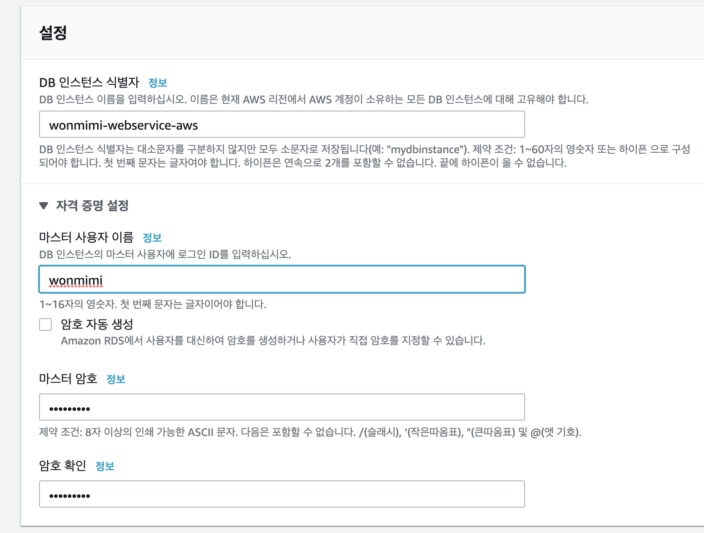

3) 퍼블릭 엑세스 - '네' 설정
  - 후에 보안그룹에서 지정된 IP 만 접근하도록 설정

  

4) 이외 기본설정 유지 후 '완료'

#### 2-1. 파라미터 그룹 생성
RDS > 파라미터 그룹 생성 후 , 

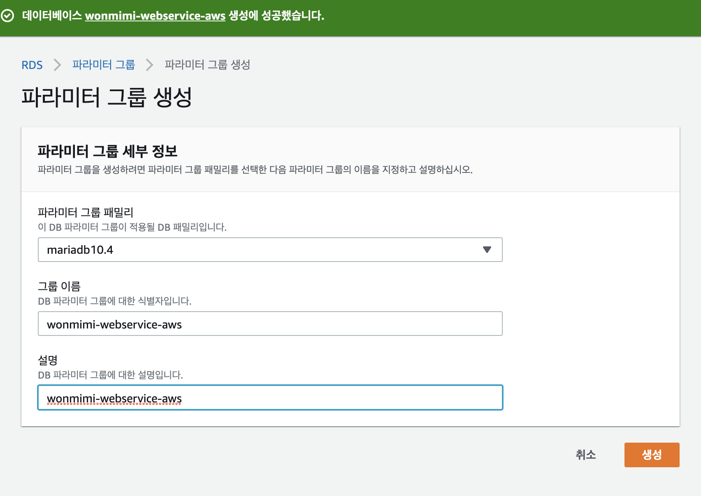

생성한 파라미터 편집 모드 전환

#### 2-2. 운영환경 맞는 파라미터 설정

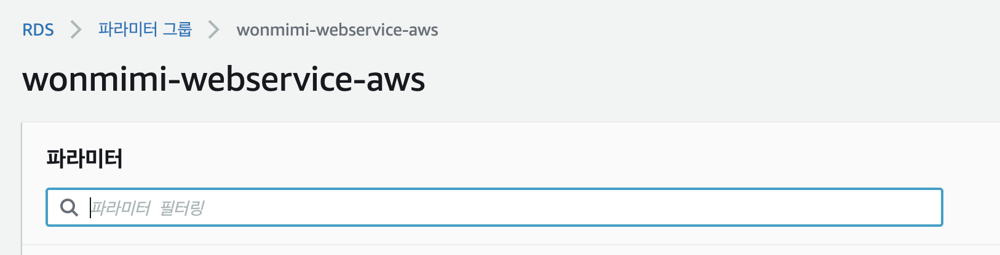

1) 타임존 설정
  * time_zone : Asia/Seoul
2) character Set
  * character_set_[ client, connection, database, filesystem, results, set_server ] : utf8mb4 ( 이모지 가능 )
  * collation_[ connection, server ] : utf8mb4_general_ci
3) Max connection 
  * 150 

으로 변경후 , 변경사항 저장

#### 2-3. 파라미터그룹 - 데이터베이스 연결
  : 데이터베이스 '수정' > 파라미터 그룹 변경하여 즉시적용

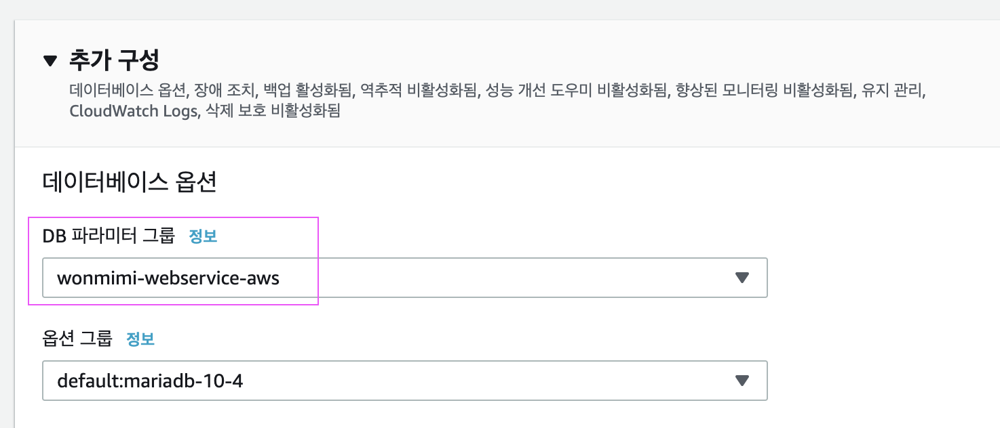

적용이 안되면 데이터베이스 '작업' > '재부팅' 후 재확인 

#### 3. 로컬 pc 에서 RDS 접속 
- RDS 세부정보 > '보안그룹'
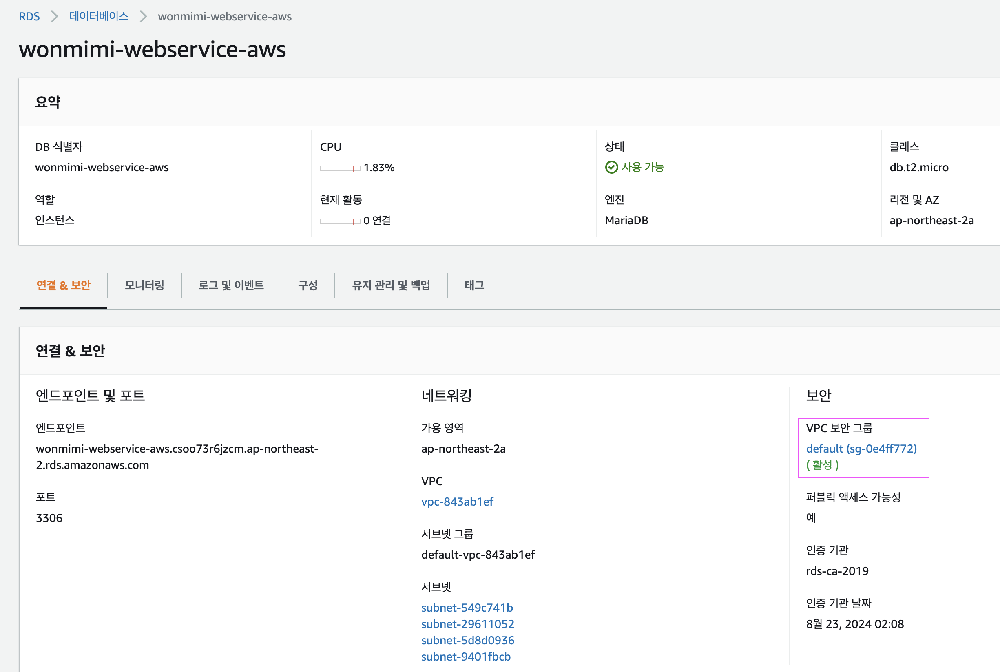

- RDS에 연결된 보안그룹의 인바운드 편집하여 내 ip와 ec2에 연결된 보안그룹 id 추가 

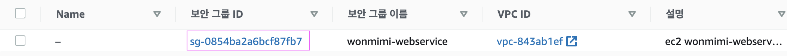
  <center>  => ec2 연결된 보안그룹 id</center><br/>
   
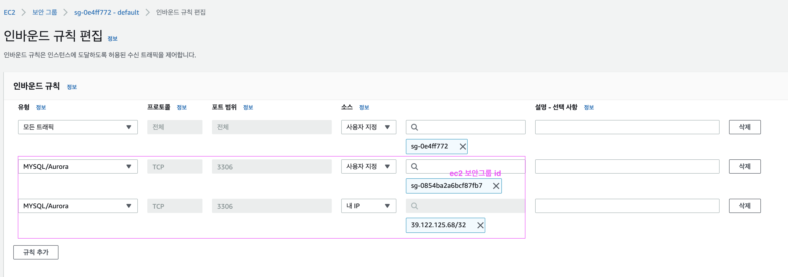
<center> 후에 모든트래픽 항목은 삭제 함. </center>

- DB 플러그인 설치
   * 인텔리제이 플러그인 : database Nabigator(무료) 설치 후 재시작 
    * 액션 검색 > Database Browser

- RDS 접속정보 등록 
Host : RDS 엔드포인트 


연결 성공시 스키마 노출, 

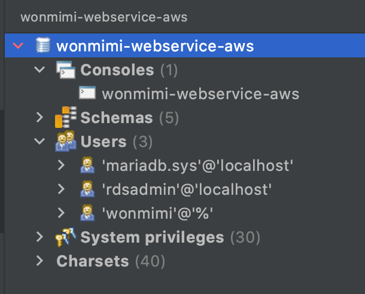

- 콘솔창 생성하여 database 선택
```sql
# DB 선택 쿼리
use [RDS 데이터베이스명]
# = wonmimi-webservice-aws
```
  * ❗️ 👉🏻  RDS 재부팅 , 서버 재접속 하였을경우 DB 재선택 필수 ❗️<br/>
  선택이 안됐을경우,  sql 실행시 ___access denied___ 가 뜬다.
- 파라미터그룹으로 설정한 characterset , collation 확인
```sql
show variables like 'c%';
```

  - character_set_database, collation_connection 는 파라이터그룹으로 변경 X, 쿼리로 수정
    - (\* 2가지 외 필드값이 기본값 latin1 으로 설정되었을경우 RDS 재부팅하여 파라미터그룹 재적용 )
  ```sql
    alter database [RDS 데이터베이스명]
    CHARACTER set ='utf8mb4'
    COLLATE = 'utf8mb4_general_ci';
  ```

- 설정한 time_zone 확인 (KST)
```sql
  select @@time_zone , now();
 ```

#### 4. EC2에서 RDS 접근
- ec2 ssh 접속 [(ssh 명령어)](./EC2.md)
- mysql 명령어 라인을 쓰기위한 CLI 설치 
```zsh
  sudo yum install mysql
```
<center> - 설치 완료  - </center>

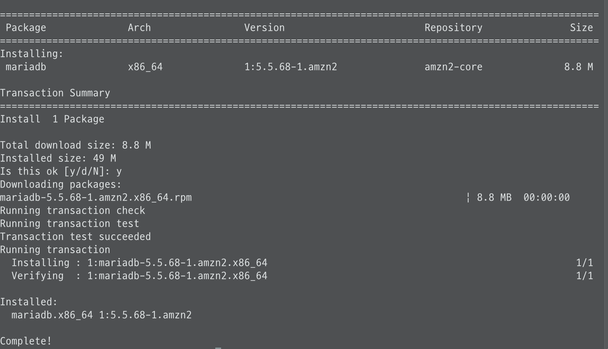

- mysql 접속
```zsh
  mysql -u [계정] -p -h Host 주소
  # = mysql -u wonmimi -p -h wonmimi-webservice-aws.csoo73r6jzcm.ap-northeast-2.rds.amazonaws.com
```
<center> - 접속   - </center>

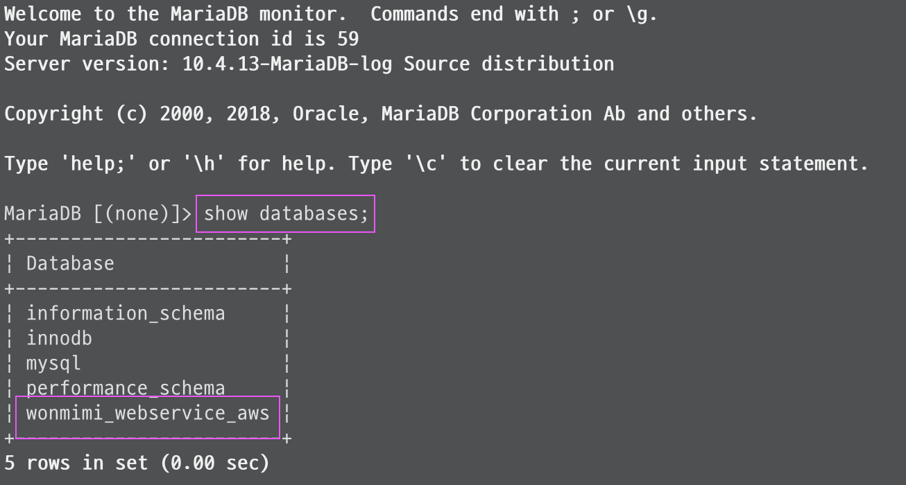 <br>

### 5. 스프링 프로젝트로 RDS 접근
#### 5-1 테이블 생성 
 H2에서 자동으로 생성해주던 테이블을 MariaDB에서 쿼리를 통해 직접 생성
  - 테스트 코드 돌렸을때 출력되는 h2로그 복사하여 쿼리로 사용
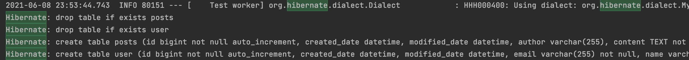

JPA가 사용될 엔티티 테이블 생성 쿼리
```sql
# posts
create table posts (
  id bigint not null auto_increment,
  created_date datetime, modified_date datetime, 
  author varchar(255), content TEXT not null, title varchar(500) not null,
primary key (id)) engine=InnoDB

#user 
create table user (
  id bigint not null auto_increment, 
  created_date datetime, modified_date datetime, email varchar(255) not null, name varchar(255) not null, picture varchar(255), role varchar(255) not null,
primary key (id)) engine=InnoDB
```

schema-mysql.sql 파일에서 스프링 세션테이블 쿼리 복사 
```sql
CREATE TABLE SPRING_SESSION (
	PRIMARY_ID CHAR(36) NOT NULL,
	SESSION_ID CHAR(36) NOT NULL,
	CREATION_TIME BIGINT NOT NULL,
	LAST_ACCESS_TIME BIGINT NOT NULL,
	MAX_INACTIVE_INTERVAL INT NOT NULL,
	EXPIRY_TIME BIGINT NOT NULL,
	PRINCIPAL_NAME VARCHAR(100),
	CONSTRAINT SPRING_SESSION_PK PRIMARY KEY (PRIMARY_ID)
) ENGINE=InnoDB ROW_FORMAT=DYNAMIC;

CREATE UNIQUE INDEX SPRING_SESSION_IX1 ON SPRING_SESSION (SESSION_ID);
CREATE INDEX SPRING_SESSION_IX2 ON SPRING_SESSION (EXPIRY_TIME);
CREATE INDEX SPRING_SESSION_IX3 ON SPRING_SESSION (PRINCIPAL_NAME);

CREATE TABLE SPRING_SESSION_ATTRIBUTES (
	SESSION_PRIMARY_ID CHAR(36) NOT NULL,
	ATTRIBUTE_NAME VARCHAR(200) NOT NULL,
	ATTRIBUTE_BYTES BLOB NOT NULL,
	CONSTRAINT SPRING_SESSION_ATTRIBUTES_PK PRIMARY KEY (SESSION_PRIMARY_ID, ATTRIBUTE_NAME),
	CONSTRAINT SPRING_SESSION_ATTRIBUTES_FK FOREIGN KEY (SESSION_PRIMARY_ID) REFERENCES SPRING_SESSION(PRIMARY_ID) ON DELETE CASCADE
) ENGINE=InnoDB ROW_FORMAT=DYNAMIC;

```
테이블 생성 완료

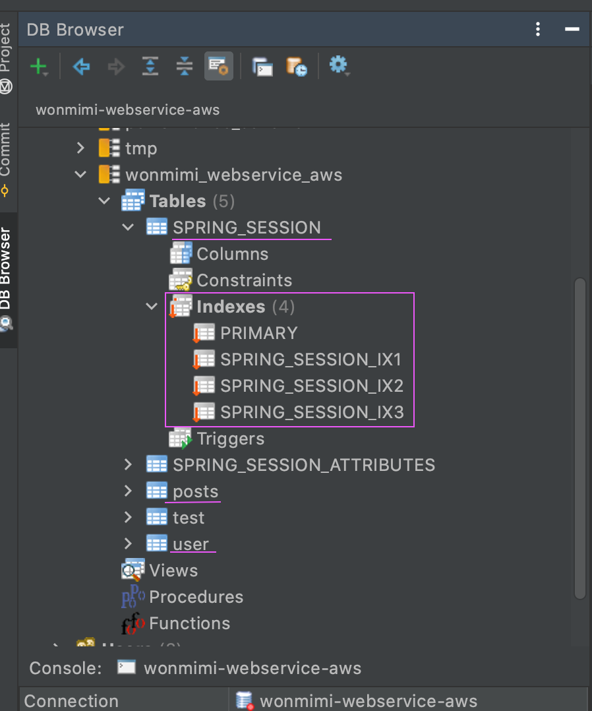

  #### 5-2 프로젝트 설정 
  : maria DB에 접근하기 위해 데이터베이스 드라이버 추가
  #### 5-3 EC2 (리눅스 서버) 설정 
  : 중요 정보가 포함된 접속정보 서버내부에서 관리하도록 설정
