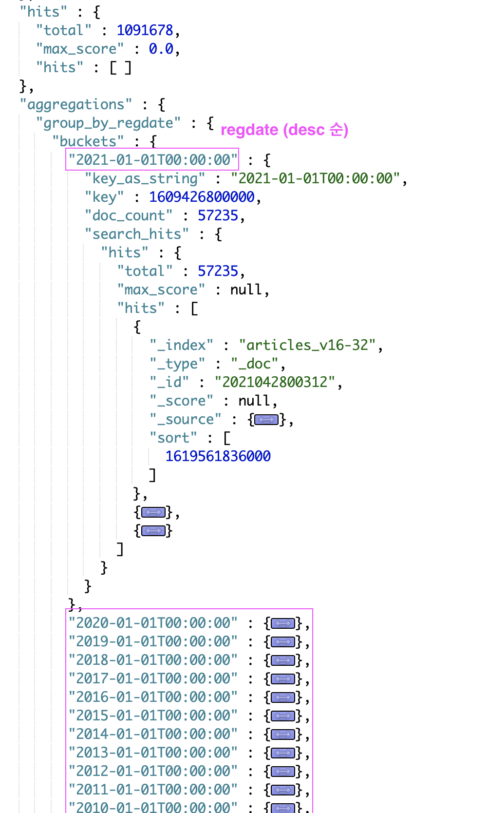

#### 1. 날짜 필드 연도별 group by 
- query 로 데이터 조건 설정 ( = where)
- aggs  : regdate 필드값의 desc 순으로 group by
  - aggs : top_hits 로 해당 group에 hits 출력
```sql
## 연도별 count
GET /articles/_search
{
  "query": {
    "bool": {
      "must": [
        {
          "terms": {
            "site": [
              "chosunbiz"
            ]
          }
        },
        {
          "exists": {
            "field": "arc_id"
          }
        },
        {
          "exists": {
            "field": "arc_migration"
          }
        }
      ]
    }
  },
  "size": 0,
  "aggs": {
    "group_by_regdate": {
      "date_histogram": {
        "field": "regdate",
        "interval": "1y",
        "keyed": true,
        "format": "YYYY-MM-dd'T'HH:mm:ss",
        "time_zone": "Asia/Seoul",
        "order": {
          "_key": "desc"
        }
      },
      "aggs": {
        "search_hits": {
          "top_hits": {
            "_source": {
              "includes": [
                "_id",
                "title",
                "arc_id",
                "regdate"
              ]
            },
            "sort": [
              {
                "regdate": {
                  "order": "desc"
                }
              }
            ]
          }
        }
      }
    }
  }
}
```

결과 <br> 
키 field : regdate값을 desc 순으로 데이터 group by 
doc_count로 hits별 갯수 확인하기 용이 
 

[참고 - aggs range](https://www.elastic.co/guide/en/elasticsearch/reference/current/search-aggregations-bucket-range-aggregation.html) <br>
[참고 - aggs top_hits](https://www.elastic.co/guide/en/elasticsearch/reference/current/search-aggregations-metrics-top-hits-aggregation.html)