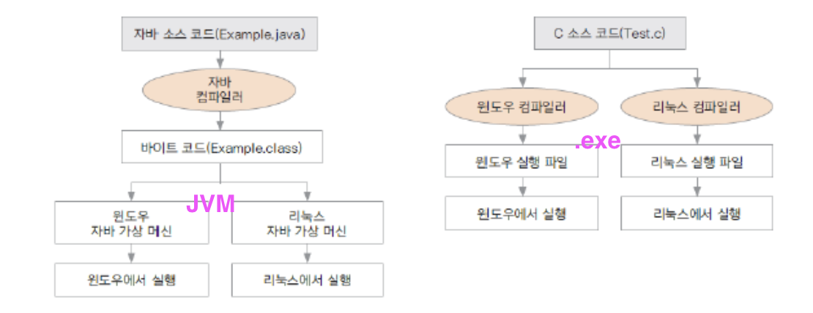

### JAVA Study 정리
> Chap 01

#### 특징

- 플랫폼(OS)에 영향을 받지 않으므로 다양한 환경에서 사용할 수 있다(독립적).
- 프로그램이 안정적이다.
- ___객체 지향___ 언어이기 때문에 유지보수가 쉽고 확장성이 좋다.
  - Object oriented programming(OOP)
  - 시간의 흐름순이 아닌 객체간의 관계와 협력을 기반으로 프로그램 구현
  - Ex) Java, C++, C#, Python, JavaScript, Ruby ...
-  다양한 기능이 제공되는 오픈 소스
  * JDK(Java Development Kit) : 자바에서 제공되는 개발용 라이브러리
  * JRE(Java Runtime Environment) : 자바 프로그램이 실행되는 환경 (\*JRE는 8.0까지 무료 )
  * JVM(Java Virtual Machine) : 자바 가상 머신 = 프로그램이 실행되는 환경. (\* JRE 를 설치하면 JVM도 설치되어있다)

  ### TIL
  - 패키지네이밍은 소문자 + 숫자
  - 클래스 네이밍은 대문자로 시작
  - main 함수는 프로그램 구동을위함 
    * 보통 웹서버로 구동하므로 항상 사용하는것은 아니다.
  - 인텔리제이에서 컴파일후 생성된 .class 파일은 /out/production/ 하위 [(레퍼런스)](https://www.jetbrains.com/help/idea/compiling-applications.html#compilation_output_folders)

