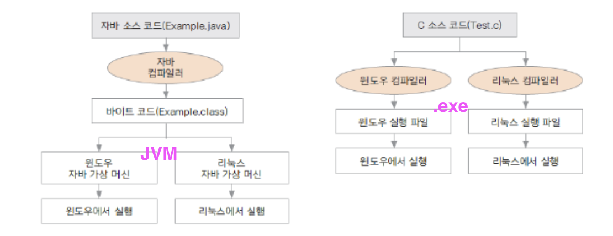
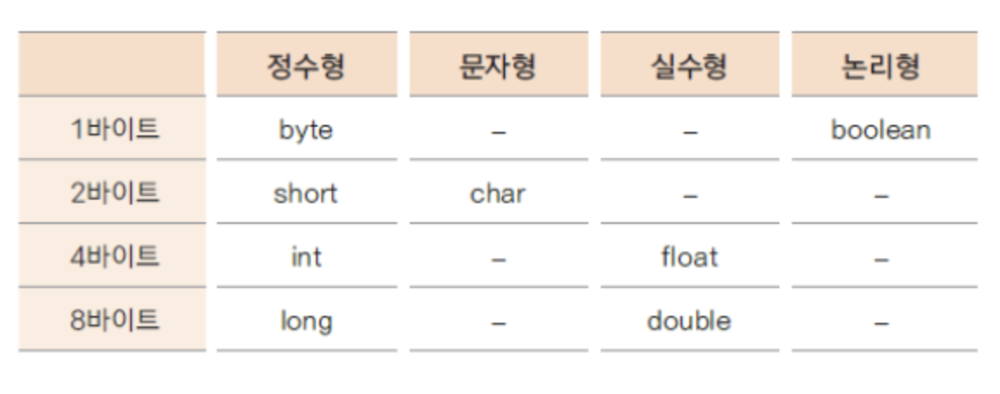
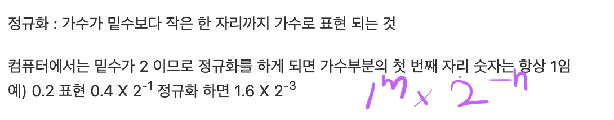

### JAVA Study 정리
> Chap 01

#### 특징

<!--  -->

- 플랫폼(OS)에 영향을 받지 않으므로 다양한 환경에서 사용할 수 있다(독립적).
- 프로그램이 안정적이다.
- ___객체 지향___ 언어이기 때문에 유지보수가 쉽고 확장성이 좋다.
  - Object oriented programming(OOP)
  - 시간의 흐름순이 아닌 객체간의 관계와 협력을 기반으로 프로그램 구현
  - Ex) Java, C++, C#, Python, JavaScript(Object oriented influece), Ruby ...
-  다양한 기능이 제공되는 오픈 소스
  * JDK(Java Development Kit) : 자바에서 제공되는 개발용 라이브러리
  * JRE(Java Runtime Environment) : 자바 프로그램이 실행되는 환경 (\*JRE는 8.0까지 무료 )
  * JVM(Java Virtual Machine) : 자바 가상 머신 = 프로그램이 실행되는 환경. (\* JRE 를 설치하면 JVM도 설치되어있다)

### 자료형 (data Type)
- 1Byte = 8bit
- 리터럴 = 숫자, 문자 , 문자열 지칭
  * 숫자에서 정수는 기본타입이 int , 실수는 double
  * 정수 long 형은 숫자뒤에 L 또는 ㅣ (1234567890L)
  * 실수 float형은  뒤에 f (3.123f)
- 기본 자료형 ( <=> 객체 데이터 타입)
<!--  -->

- 실수는 부동소수점 방식으로 표현

- 문자는 정수(양수)로 표현된 문자셋트 = character set ( ex 아스키 코드, 8bit) 
- 자바는 [유니코드](http://www.unicode.org/charts/PDF/UAC00.pdf) 사용 (전세계 표준 문자이고 아스키코드와 호환 ,utf-16 , 16bit)
  * A => 65 (인코딩) , A <= 65 (디코딩)
  * 'a' : 문자 , "a" : 문자열
  * utf-8 은 1~4 바이트 사용하여 다양한 문자 사용

- valueOf , parseInt [차이](https://brunch.co.kr/@artiveloper/11)
- - - 
### TIL
- 패키지네이밍은 소문자 , 숫자
- 클래스 네이밍은 대문자로 시작
- main 함수는 프로그램 구동을위함 
  * 보통 웹서버로 구동하므로 항상 사용하는것은 아니다.
- 인텔리제이에서 컴파일후 생성된 .class 파일은 /out/production/ 하위 [(레퍼런스)](https://www.jetbrains.com/help/idea/compiling-applications.html#compilation_output_folders)
- 변수 네이밍 규칙 
  * 변수 이름은 대/소문자 , 숫자 사용 가능, 특수문자 는 $와 _만 사용
  * 자바에서 이미 사용하고 있는 예약어는 사용할 수 없음 (Ex: while, break )
- 카멜케이스 (camelCase)원칙
- 모두 숫자 먼저 시작 X

- - - 
[참고 강의](https://gitlab.com/easyspubjava/javacoursework)