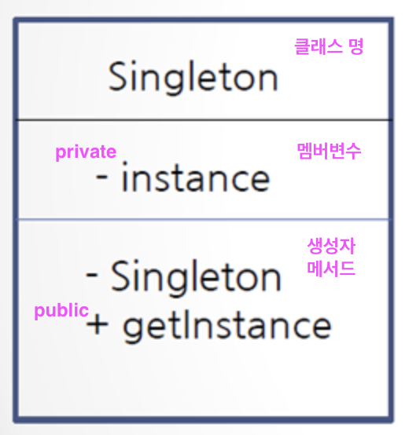
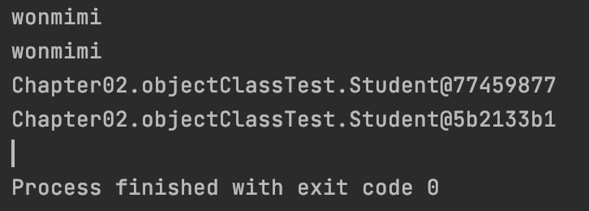

## < 객체 >
- 데이터의 단위 ( Ex :  회원, 생산, 주문, 배송 )
- 자바 모든 클래스의 최상위 클래스 : Object

- 객체 지향 프로그래밍 구현 
  * 객체 정의 
  * 각 객체 제공하는 기능(속성 : property) 들을 구현
  * 각 객체가 제공하는 기능들 간의 소통(파라미터, 객체 ... 전달)을 통하여 객체간의 협력을 구현
- - - 
- [클래스](#1-클래스)
- [함수와 메서드](#2-함수와-메서드)
- [인스턴스](#3-인스턴스-instance)
- [생성자](#4생성자-constructor)
- [접근 제어 지시자 & 정보은닉](#5-접근-제어-지시자와-정보은닉)
- [static](#6-static)
- [추상 클래스](#추상-클래스-abstract)
- [final](#final-키워드)
- [인터페이스](#인터페이스-interface)
- [제네릭](#제네릭-generic)


### 1. 클래스
- 객체의 속성은 클래스의 멤버 변수(member variable)로, 역할을 메서드(method)로 선언하여 정의
  * 빈값으로 선언하였을때 멤버변수는 자동 초기화 (string : null, int : 0 <=> 지역변수 )
- 클래스명은 대문자로 시작 (CamelCase)
- 변수, 메서드명은 소문자로 시작
- 한 java 파일에  여러 클래스가 있을 수 있지만 public 클래스는 오직 하나
  * public 클래스 이름 =  .java 파일 이름
- - - 
### 2. 함수와 메서드
#### 2-1. 함수 (function)
- 기능을 실행하는 코드
- 호출하여 사용하고 호출된 함수는 기능이 끝나면 제어가 호출시점으로 반환됨
- 함수로 구현된 기능은 여러 곳에서 호출되어 사용될 수 있음
- 어딘가에 속하지않는 단독 모듈
#### 2-2. 함수 호출 스택(stack) 메모리
- 함수가 호출될 때 지역 변수들이 사용하는 메모리
- 함수 실행이 끝나면 자동으로 반환 되는 메모리


#### 2-3. 메서드 (method)
- 객체의 기능을 구현하기 위해 클래스 내부에 구현되는 함수 = 멤버 함수 (member function)
- 메서드의 이름은 그 객체를 사용(호출)하는 객체(=클라이언트)에 맞게 네이밍 (ex  getStudentName() )
- - - 
### 3. 인스턴스 (instance)
#### 3-1. 인스턴스 생성
- 인스턴스 : 클래스를 기반으로 new 키워드를 사용하여 메모리에 생성
  * 생성된 인스턴스는 각각 다른 멤버변수(참조변수) 값(참조값)을 가진다
    * 참조변수 : 메모리에 생성된 인스턴스를 가리키는 변수
    * 참조값 : 생성된 인스턴스의 메모리 주소 값
    ```java
       Student studentJung = new Student(); // 참조변수
       System.out.println(studentJung); //참조값 출력 
       //=> [패키지명].Student@1218025c  jvm이 부여한 가상주소값 
    ```

#### 3-2. 힙(heap) 메모리 (= 동적메모리)
- 생성된 인스턴스는 힙 메모리에 할당됨
- 자바에서 Gabage Collector 가 주기적으로 사용하지 않는 메모리를 수거
  * C, C++에서는 해제시켜야함 (free() , delete)
- 하나의 클래스에서 여러 인스턴스가 생성되면 각각 다른 메모리주소를 가짐


- - - 
### 4.생성자 (constructor)
  - 생성자는 객체를 생성하기 위해 new 와 함께 호출
  - 객체가 생성될 때 변수, 상수를 초기화 하거나 초기화 기능을 하는 메서드를 호출
  - 생성자는 반환 값이 없고 클래스의 이름과 동일
  - 생성자는 보통 외부접근이 가능(public) 하지만 private 으로 선언되는 경우도 있음
  - 오버로딩(같은 클래스명, 파라미터 다름) 하여 생성자 여러개 정의 가능,  필요에 따라 호출하여 사용
  - 보통 0으로 시작하는 숫자를 표현할땐 String 타입을 사용
#### 4-1. 기본생성자 (default constructor)
- 클래스에는 적어도 하나 이상의 생성자가 존재
- 생성자를 구현하지 않아도 new 키워드와 함께 생성자를 호출
  * 컴파일러가 생성자 코드를 자동생성 
  ```java
  public className () { ... } 
  ```
- 매개 변수, 구현부가 없다
- 생성자 직접 구현 가능
#### 4-2. 참조자료형 변수
- 클래스형 변수 선언 하여 해당변수를 생성해여야 한다
  * (String 클래스는 예외적으로 생성하지않고 사용 가능)
- 기본 자료형은 사용하는 메모리의 크기가 정해져 있고, 참조 자료형은 클래스에 따라 다름
- - - 

### 5. 접근 제어 지시자와 정보은닉
#### ___5-1. 접근 제어 지시자(access modifier)___
- 클래스 외부에서 클래스의 멤버 변수, 메서드, 생성자를 사용 여부를 지정하는 키워드
- private : 같은 클래스 내부에서만 접근 가능 ( 외부 클래스, 상속 관계의 클래스에서도 접근 불가)
  * get() , set() : private 으로 선언된 멤버 변수에 대해 접근, 수정할 수 있는 메서드.  public으로 제공
  * get() 메서드만 제공 되는 건 read-only 필드
get() 메서드만 제공 되는 경우 read-only 필드
- 아무것도 없음 (default) : 같은 패키지 내부에서만 접근 가능 ( 상속 관계라도 패키지가 다르면 접근 불가 - import 추가 )
- protected : 같은 패키지나 상속관계의 클래스에서 접근 가능하고 그 외 외부에서는 접근 할 수 없음
- public : 클래스의 외부 어디서나 접근 할 수 있음

#### ___5-2. 정보 은닉___
외부에서 접근 가능한 최소한의 정보를 오픈하여 객체의 오류를 방지

ex) private 필드인 isValid로 정보은닉
```java
public void setMonth(int month) {
		
		if ( month < 1 || month > 12) {
			isValid = false;
		}
		else {
			this.month = month;
		}
	}

```
#### ___5-3 캡슐화 (encapsulation)___
정보은닉을 활용하여 필요한 정보와 기능만 외부에 오픈
- 대부분의 멤버 변수와 메서드를 감추고 외부에 통합된 인터페이스만 제공하여 client코드에서 일관된 기능을 구현
  * hide된 속성들은 client코드 쪽에선 알 필요가 없다.
- client코드 에서 메서드나 멤버변수에 접근함으로써 발생하는 오류 최소화 

- - - 
### 6. static 
여러 인스턴스에서 공통으로 사용하여 메모리 `공유`
#### 6-1 static (정적) 변수

- 처음 프로그램이 메모리에 로딩될 때 메모리를 할당하여 프로그램 종료시 해제


- 인스턴스 생성과 상관 없이 사용 가능하므로 클래스 이름으로 직접 참조 📌
- = 클래스 변수, 정적변수라고도 함(<-> 인스턴스 변수)

메모리 영역


#### 6-2. static 메서드 
- 인스턴스 생성과 무관하게 클래스 이름으로 호출( = 클래스 메서드 , 정적 메서드) 📌
- static 메서드 내부에서는 인스턴스 변수를 사용할 수 없음
  *  인스턴스 생성 전에 호출 될 수 있기 때문
- static 변수는 사용가능 
- this 키워드도 사용할수 없다

```java
public class Employee {

	private static int serialNum = 1000; 
	
	private int employeeId;
	private String employeeName;
	private String department;

    public static int getSerialNum() {
      return serialNum;
    }

    public static void setSerialNum(int serialNum) {
      Employee.serialNum = serialNum; 📌
    }

    ...
}

public class EmployeeTest {

	public static void main(String[] args) {
		Employee employeeLee = new Employee();
		employeeLee.setEmployeeName("이순신");
    System.out.println(Employee.getSerialNum());
		
		Employee employeeKim = new Employee();
		employeeKim.setEmployeeName("김유신");
		
	}
}

```

#### 6-3. 변수 유효범위(scope)와 메모리
지역변수, 멤버 변수, 클래스 변수는 유효범위와 life cycle, 사용하는 메모가 다름


- static 변수는 프로그램 실행동안 메모리영역을 차지하므로 너무 큰 메모리를 할당하지 않도록 유의
- 클래스 내부의 여러 메서드에서 사용하는 변수는 멤버 변수로 선언
- 멤버 변수가 너무 많으면 인스턴스 생성 시 불필요한 메모리가 할당

#### 6-4. 싱글톤 패턴 (Singleton pattern)
프로그램에서 인스턴스(객체)가 단 한 개만 생성되어야 할때 사용하는 디자인 패턴
- 서로 자원을 공유할때 주로 사용 ex) 스프링 빈 , (현실)프린터 기계
- 객체 구현  
  - static 변수, 메서드를 활용하여 구현 할수있음
  - 생성자는 private으로 선언 (외부에서 new 할수 없게하기위해)
  - 클래스 내부에 유일한 private 인스턴스 생성
  - 외부에서 유일한 인스턴스를 참조할 수 있는 public 메서드 제공
    * Calender 클래스는 싱글톤패턴으로 사용되도록 이루어져있음


```java
public class Company {

    private static Company instance = new Company();
    private Company() {}

    public static Company getInstance(){ // 외부에서 접근 가능하도록
        if(instance == null){
            instance = new Company(); // 없을경우 생성 (방어적)
        }
        return instance;
    }
}

public class CompanyTest {
    public static void main(String[] args) {
        Company company1 = Company.getInstance(); // 클래스 이름으로 접근
        Company company2 = Company.getInstance();

        System.out.println(company1);
        System.out.println(company2);
    /*
        => 참조 변수 주소값 같다
        Chapter02.ch18.Company@23fc625e
        Chapter02.ch18.Company@23fc625e
    */

        Calendar calendar = Calendar.getInstance();
    }
}

```
클래스 다이어그램



- - - 
### [Object](https://docs.oracle.com/javase/7/docs/api/java/lang/Object.html) 클래스

#### 1. clone() 메서드
: 객체를 복제하는 기능 제공
```java
class Student implements Cloneable{
    String name;
    Student(String name){
        this.name = name;
    }
    //check Exception
    protected Object clone() throws CloneNotSupportedException{
        return super.clone();
    }
}

class Main {
    public static void main(String[] args) {
        Student s1 = new Student("wonmimi");
        try {
            Student s2 = (Student)s1.clone();
            System.out.println(s1.name);
            System.out.println(s2.name);
        } catch (CloneNotSupportedException e) {
            e.printStackTrace();
        }
    }
}

```
실행 결과 
: name값이 같은 인스턴스 복제됨



 비어있는 Cloneable 인터페이스를 구현하는 이유는 복제 가능함을 VM에 알리는 표시같은 역할 
 ```java
  public interface Cloneable {}
 ```

 ---
### 추상 클래스 (abstract)
<=>  구체 클래스 (concrete)
- abstract 예약어 사용
- 구현부 없이 메서드의 선언만 있는 추상 메서드(abstract method)를 
포함한 클래스
  * 선언 : 반환타입 , 메서드명, 매개변수로 구성
```java
  public abstract class Computer { 📌
    public abstract void display(); //📌 구현부 없음 
    public abstract void typing();
  }
```
- abstract로 선언된 메서드를 가진 클래스는 abstract로 선언
- 추상 클래스는 인스턴스화 할수없다 (new 객체생성 X)
- 모든 메서드가 구현 된 클래스라도 abstract로 선언되면 추상 클래스로 인스턴스화 할 수 없음
  * 직접 객체 생성하지않고 상속해서 쓰는 용도인 경우가 많다
```java
    Computer computer = new Computer(); // ❌ error
```
- 추상 클래스의 추상 메서드는 하위 클래스가 상속 하여 구현
- 추상 클래스 내의 구현 된 메서드 : 하위 클래스가 공통으로 사용하는 메서드
  * 하위 클래스에서 재정의 가능
- [예제 코드](https://github.com/wonmimi/java/tree/main/src/Chapter03/ch09)

### 추상클래스 응용 - 템플릿 메서드 패턴
- 추상 메서드나 구현 메서드를 활용하여 코드의 시나리오를 정의 하는 메서드
- 프레임워크에서 많이 사용되는 설계 패턴
- [final](#final-키워드)로 선언하여 하위 클래스에서 재정의 할 수 없게 함
- 추상 클래스인 상위 클래스에서 템플릿 메서드를 활용하여 전체적인 흐름을 정의 하고, <br>
 하위 클래스에서 재정의 해야하는 부분은 추상 메서드로 선언하여 하위 클래스에서 구현 하도록 함
```java
    // 코드 시나리오
    final public void run(){ 📌
        startAction();
        display();
        typing();
         ...
    }
```
- [예제 코드](https://github.com/wonmimi/java/tree/main/src/Chapter03/ch10)

### final 키워드
변수나 메서드 또는 클래스가 `변경 불가능`하도록 만든다.
- 원시(Primitive) 변수일 때  해당 변수의 값은 변경이 불가능하다.
- 참조(Reference) 변수일 때 힙(heap) 내의 다른 객체를 가리키도록 변경할 수 없다.
- 메서드에 적용할 때 해당 메서드를 오버라이드할 수 없다.
- 클래스에 적용 시 해당 클래스의 하위 클래스를 정의할 수 없다.(= 상속받을수 없다)
- final 변수는 `클래스명.변수`로 사용 할 수 있다.
```java
public class Sample {

	public static final String INTRO = "Good Morgning ~";
  ...
  System.out.println(Sample.INTRO); 📌
}

```
- - - 
### 인터페이스 (interface)
- 모든 메서드가 추상 메서드로 선언된다 public abstract 
- 모든 변수는 상수로 선언됨 public static final
  * 자바 8 부터 [디폴트 메서드](https://siyoon210.tistory.com/95)(default method)와 정적 메서드(static method) 기능의 제공으로 일부 구현 코드가 있음
- 인터페이스로 인스턴스 생성 할수 없다 
  * 하위클래스에서 구현(implements) 하여 생성
```java
public interface Calc { 📌
    double PI = 3.14;
    int ERROR = -99999999;

    int add(int num1, int num2);
    .,.
}
```


- 인터페이스를 구현한 클래스는 인터페이스 형으로 선언한 변수로 형 변환 할 수 있음 (Type 상속)
- 상속에서 형 변환과 동일한 의미
``` java
// 인터페이스 Calc , 구현클래스 CompleteCalc
Calc calc = new CompleteCalc();
```


-  형 변환되는 경우 인터페이스에 선언된 메서드만 사용가능하다
- 구현 코드가 없으므로 여러 인터페이스를 구현할 수 있다
  * 클래스 다중삭속은 불가
- [예제 코드](https://github.com/wonmimi/java/tree/main/src/Chapter03/ch11)

> 인터페이스는 왜쓰는 걸까 ?
- 클라이언트 코드와의 약속이며 클래스나 프로그램이 제공하는 명세(specification)
  * 클라이언트 프로그램은 인터페이스에 선언된 메서드 명세만 보고 이를 구현한 클래스를 사용 한다
- 어떤 객체가 하나의 인터페이스 타입이라는 것은 그 인터페이스가 제공하는 모든 메서드를 구현했다는 의미이다
- 인터페이스를 구현한 다양한 객체를 사용 - `다형성`
<br>ex) JDBC 인터페이스
  * JDBC 인터페이스 명세를 보고 서드파티 (Oracle , Mysql ... )
에서 dbconnection 부분을 구현 
- 동일한 인터페이스를 구현하면 클라이언트 에서는 어떤 모듈을 쓰더라도 동일하게 
사용 할 수 있다.
- - - 

### 제네릭 (generic)
>  = 일반화
- 클래스에서 변수의 자료형이 여러개 이고 기능(메서드)이 동일한 경우 `클래스의 자료형을 특정하지 않고` 해당 클래스를 사용할 때 지정 할 수 있도록 선언
- 자료형 변환은 컴파일러에 의해 검증되므로 안정적인 프로그래밍 방식
- 컬렉션(collection) 프레임워크에서 많이 사용되고 있음

제네릭 클래스 
```java
public class GenericPrinter<T> {  📌 // 1️⃣-1
	private T material; 1️⃣
	
	public void setMaterial(T material) {
		this.material = material;
	}
	
	public T getMaterial() { 📌
		return material;
	}
	
	public String toString(){
		return material.toString();
	}
}
```
- 1️⃣ T(type parameter) 자료형 매개변수 : 클래스 사용 시점에 실제 사용할 자료형 지정 ( static 변수는 사용할 수 없음)
  * 1️⃣-1  제네릭 자료형
- E : element, K: key, V : value ... 여러 알파벳을 의미에 따라 사용
- 2️⃣ T 자료형을 반환하는 제네릭 메서드


#### 다이아몬드 연산자 `<>`
- 다이아몬드 연산자 내부에서 자료형 생략가능
```java
  GenericPrinter<Powder> powderPrinter = new GenericPrinter<Powder>();
  powderPrinter.setMaterial(new Powder());
  GenericPrinter<Plastic> plasticPrinter = new GenericPrinter<>(); // 타입 생략 가능
  ArrayList list = new ArrayList<>();
```
- 다이아몬드 연산자로 타입 지정 안할시 Object로 간주 (필요시 형변환 필요)
```java
  GenericPrinter powderPrinter = (Powder)new GenericPrinter<Powder>(); // => Object
```

- 자바10부터 제네릭에서 지역변수 자료형 추론 가능
```java
ArrayList list = new ArrayList()  
=> var list = new ArrayList();
```

### <T extends 클래스>
- 상위 클래스에서 선언하거나 정의하는 메서드를 활용할 수 있음 <br>
 👉🏻 T 자료형의 범위를 제한 할 수 있음
- 상속을 받지 않는 경우 T는 Object로 변환
  *  Object 클래스가 기본으로 제공하는 메서드만 사용가능
```java
public class GenericPrinter<T extends Material> {
    private T material;
    ...
}
```
```java
public class Powder extends Material{
  ...
}
```

### 제네릭 메소드
- 자료형 매개변수를 메서드의 매개변수나 반환 값으로 가지는 메서드
  * 자료형 매개 변수가 하나 이상인 경우도 있음
```java
  public class Point<T, V> {
	
    T x;
    V y;
    
    Point(T x, V y){
      this.x = x;
      this.y = y;
    }
    
    public  T getX() {
        return x;
    }
  ...
  }
```
- 제네릭 클래스가 아니어도 내부에 제네릭 메서드 구현 가능
```java
  public <자료형 매개변수> 반환형 메서드명 ( 매개변수 ... ) { ... }
```
```java
    public static <T, V> double makeRectangle(Point<T, V>p1, Point<T, V>p2){ 1️⃣
        double left = ((Number)p1.getX()).doubleValue(); 2️⃣
        ...
         double top = ((Number)p1.getY()).doubleValue();
        ...
    }
    public static void main(String[] args) {
        Point<Integer, Double> p1 = new Point<Integer, Double>(0, 0.0);
        Point<Integer, Double> p2 = new Point<>(10, 10.0); // 자료형 매개변수형 생략가능

        double size = GenericMethod.<Integer, Double>makeRectangle(p1, p2);
        ...
    }
```
- 1️⃣ static 사용 [이유](https://m.blog.naver.com/PostView.naver?isHttpsRedirect=true&blogId=ziopantazy&logNo=10169604959)
- 2️⃣ Number 객체 [~value()](https://jamesdreaming.tistory.com/136) 메서드 사용

- [컬렉션 프레임워크](../DataStructure.md)