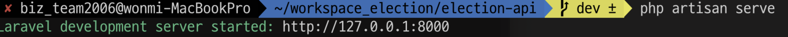

## 라라벨 로컬 환경 컴포저 셋팅
- sfrp.json 파일 수정 (tool :vsCode)
```json
"uploadOnSave": false,
"downloadOnOpen": false,
    "ignore": [
        ".vscode",
        ".git",
        "vendor",
        ".DS_Store"
    ]
```

=> 로컬에 실행하는 것과 별개로 , sftp 업로드 되지 않도록 <br>
보통 uploadOnSave = false 로 지정하는게 확실ㅎ 

- 해당 작업 워크스페이스위치에서 (ex) /election-api
```shell
composer install
```
  => vendor 폴더생김 
- 서버 composer.json에서 받고 수정

```json
"require-dev": {
        "facade/ignition": "^1.4",
        "fakerphp/faker": "^1.9.1",
        "mockery/mockery": "^1.0",
        "nunomaduro/collision": "^3.0",
        "phpunit/phpunit": "^8.5.8|^9.3.3"
    },

```
- 서버 시작

```bash
php arisan serve
```

- 출력된 로컬 ip 접속해서 실행

