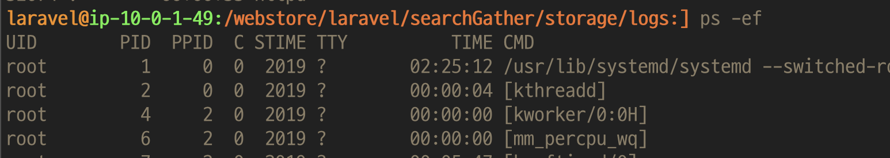
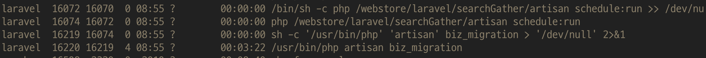

### Linux 명령어 정리
 - - - 
#### 1.  ps
:  현재 돌아가고있는 프로세스 확인
<br>
>  Ex) 검색 수집기 작업중 실시간 마이그레이션 스케줄링을 중단해야할 상황이 생겨 
> 실행중인 프로세스를 강제 종료 함.

- 프로세스 목록 확인 
```bash
ps -ef 
```

- 특정 프로세스 확인
```bash
ps -ef | grep 프로세스명 
```




- 프로세스 중단 시키기 
```bash
kill [옵션] PID
# kill -9 pid
```
 <br>
 - -9: 강제종료 
    * 작업중인 모든 데이터를 저장하지 않고 프로세스를 종료, 저장되지 않은 데이터는 소멸됨
 -  -15 : 정상종료
    * 메모리상에 있는 데이터와 각종 설정/환경 파일을 안전하게 저장한 후 프로세스를 종료

[참고](https://yang1650.tistory.com/110)

- - - 

#### 2. cp
: 복사 하는 명령어 
- 파일1을 파일2로 바꾸어 복사 
```zsh
  cp 파일1 파일2
```
- 디렉토리b가 없다면 -> 파일a을 파일b로 복사 <br>
  디렉토리b가 있다면 -> 디렉토리b안에 파일a를 복사
```zsh
  cp 파일a 디렉토리b
```
[참고](https://www.manualfactory.net/10805)
- - - 

#### 3. pgrep
: ps + grep 원하는 정보 찾기
```zsh
# ex) 
CURRENT_PID=$(pgrep -f ${PROJECT_NAME}.*.jar)
```
- -f : 프로세스 이름으로 찾기
[참고](https://bigsun84.tistory.com/365)
- - - 
#### 4. ls
: 현재경로 또는 [디렉토리]에 있는 파일 , 디렉토리 정보 출력 <br>
```zsh
  ls [옵션] [디렉토리]
```

[\* 옵션 \*] (여러개 함께사용가능)
  - -t : 수정된 시간순 (최신순)
  - -r : 반대로 출력 

[참고](https://big-sun.tistory.com/27)

- - - 

#### 4. tail
: 파일의 로그를 볼떄 주로 사용
```zsh
  tail [옵션] [파일]
  # tail -n 1
  # tail -n +10 
```
  - -n : 원하는 라인수 (마지막 라인 부터)
  - n + N : N번째줄 이후부터
[참고](https://m.blog.naver.com/PostView.naver?isHttpsRedirect=true&blogId=yoodh0713&logNo=221596485819)

### 5. nohub
: 터미널을 종료해도 애플리케이션이 계속 실행될수있도록 백그라운드에서 실행 시키는 명령어
```zsh
  nohup [명령]  2>&1 &
  ```

[참고](https://ourcstory.tistory.com/197)
<!-- ### curl  -->