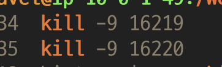

### ps 
###### : 현재 돌아가고있는 프로세스 확인
- 프로세스 목록 확인
```bash
ps -ef 
```

- 특정 프로세스 확인
```bash
ps -ef | grep 프로세스명 
```


- 프로세스 중단 시키기 
```bash
kill -9 PID
```
-9는 강제종료 



[참고](https://yang1650.tistory.com/110)