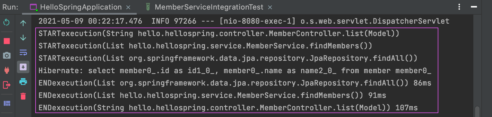

## AOP
: Aspect Oriented Programming

- 공통 관심 사항(cross-cutting concern) / 핵심 관심 사항(core concern) 분리


service 소스코드에서 AOP 적용전 Service 코드

```java
//  회원가입 
public Long join(Member member){

        long start = System.currentTimeMillis();

        try{
          // 서비스 코드
            validateDuplicateMember(member); // 중복 회원 검증
            memberRepository.save(member);
            return member.getId();
        } finally {
          // 공통 코드
            long finish = System.currentTimeMillis();
            long timeMs = finish - start;
            System.out.println("join = " + timeMs + "ms");
        }

    }
  ```
```java
//  전체 조회 
    public List<Member> findMembers(){
        long start = System.currentTimeMillis();
        try{
          // 서비스 코드
            return memberRepository.findAll();
        }finally {
          //공통 코드
            long finish = System.currentTimeMillis();
            long timeMs = finish - start;
            System.out.println("findMembers = " + timeMs + "ms");

        }
    }
```
- - - 
AOP 빈 적용
```java
@Aspect
@Component // 빈 주입 
public class TimeTraceAOP {
    // 타겟팅
    @Around("execution(* hello.hellospring..*(..))")
    // = hello.hellospring 하위 클래스 모두 적용
    public Object execute(ProceedingJoinPoint joinPoint) throws Throwable {
        long start = System.currentTimeMillis();
        System.out.println("START" + joinPoint.toString());
        try {
            return joinPoint.proceed();
        } finally {
            long finish = System.currentTimeMillis();
            long timeMs = finish - start;
            System.out.println("END" + joinPoint.toString() + " " + timeMs + "ms");

        }
    }
}
```
- @Aspect : AOP 기능을 하는 클래스의 클래스 레벨에 지정
- @Component : 개발자가 직접 정의한 클래스를 Bean으로 등록 할 수 있도록 한다
- @Around : [Advice](./annotation.md)의 종류 중 하나(총 5가지)

#
//  회원 목록 페이지 접속시, 

=> 회원가입, 회원 조회등 핵심 관심사항과 시간을 측정하는 공통 관심 사항을 분리

### 동작원리 

컨테이너에 스프링빈을 등록할때 가상(중계) 빈을 등록 후 실제 service 실행


콘솔창에서 프록시 생성 확인


- - - 

- 시간을 측정하는 로직을 별도의 공통 로직으로 생성
- 원하는 적용 대상을 선택할 수 있다. EX => @Around("execution(* hello.hellospring..*(..))")
- DI(의존성 주입)의 장점을 이용한 기술
- java generate 문법을 이용한 AOP기술도 있다.

[annotaion 참고](https://galid1.tistory.com/498)
[참고2](https://velog.io/@ayoung0073/springboot-AOP)