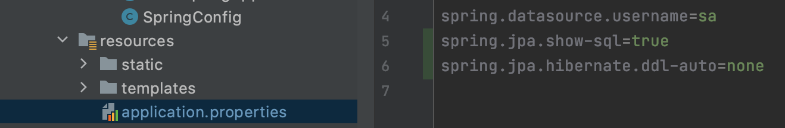
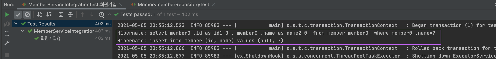

### setting
- - - 

> bundle.gradle dependency 추가
```java
	implementation 'org.springframework.boot:spring-boot-starter-data-jpa'
```

> resources > applications.properties 에서 설정 



```java
spring.jpa.show-sql=true
```
 :  실행한 쿼리를 볼수있다.

 


#

```java
spring.jpa.hibernate.ddl-auto=none
```
 :  객체를 보고 테이블을 자동으로 만든다 (true)
