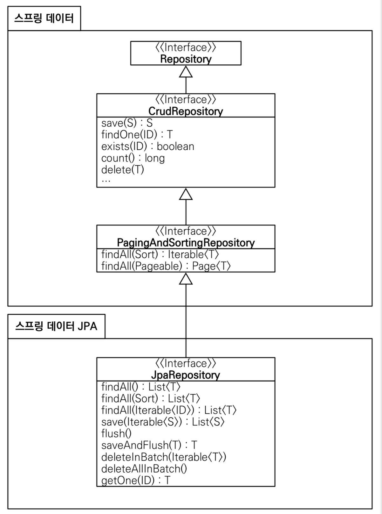

## 스프링 데이터 JPA

```java
public interface SpringDataJpaMemberRepository extends JpaRepository<Member, Long>, MemberRepository {
 ...
}
```
- JpaRepository 인터페이스를 extends 한다 (interface  -> interface : extends)
- 스프링 데이터가 제공하는 JpaRepository 가 자동으로 SpringDataJpaMemberRepository 를 확인하고 구현체로 만들어 스프링빈에 자동 등록
- interface 는 다중상속이 된다.

  

- 인터페이스를 통한 기본적인 CRUD
- 기본, 공통적인것들 메소드 ( findById ... )로 제공
- findByName() , findByEmail() 처럼 인터페이스 이름 만으로 조회 기능 제공
  ```sql
  findByName() = 
  JPQL : select m from Member m where m.name =?
  ```
- 페이징 기능 자동 제공

#

- 실무에서는 JPA와 스프링 데이터 JPA를 기본으로 사용하고, 복잡한 동적 쿼리는 Querydsl이라는 라이브러리를 사용. 
  - Querydsl을 사용하면 쿼리도 자바 코드로 안전하게 작성할 수 있고, 동적
쿼리도 편리하게 작성할 수 있다. 
  - 이 조합으로 해결하기 어려운 쿼리는 JPA가 제공하는 네이티브 쿼리를
사용하거나, JdbcTemplate를 사용한다