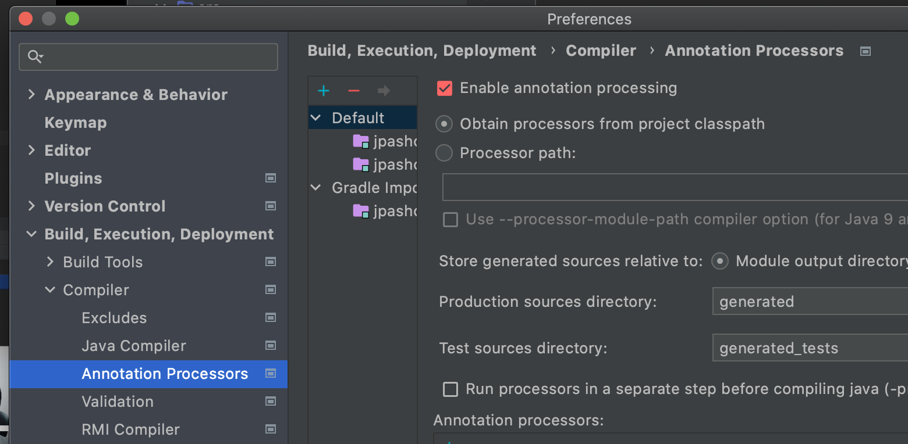

## SpringBoot 
### 프로젝트 생성
  - [스타터 페이지](https://start.spring.io/) 에서 프로젝트 생성

    

  - application run 후, localhost:8080 접속
- - -
### 롬복 셋팅 
  - 자주사용하는 코드 (Getter, Setter, 생성자 , toString ...)등을 [어노테이션](./annotation.md)으로 자동생성
  - Prefrences > plugin > lombok 설치
  - Prefrences > Annotation Processors > Enable annotation processing 체크 (재시작)
    
    

      : 프로젝트별 설정 해줘야함
  - 임의의 테스트 클래스를 만들고 @Getter, @Setter 확인

    

  - !! 적용을 했는데도 생성자가 제대로 생성이 안된경우
  ```bash
  error: variable name not initialized in the default constructor private final String name;
  ```
  에는 build.gradle 에서 annotationProcesser을 추가한다 
  ```java
  dependencies {
        annotationProcessor 'org.projectlombok:lombok'
        implementation 'org.projectlombok:lombok'
        testAnnotationProcessor 'org.projectlombok:lombok'
        testImplementation 'org.projectlombok:lombok'
    }
    configurations {
        compileOnly {
            extendsFrom annotationProcessor
        }
    }
  ```
- - - 
Ref
- [레퍼런스](https://docs.spring.io/spring-boot/docs/current/reference/html/features.html#boot-features-spring-mvc-template-engines)