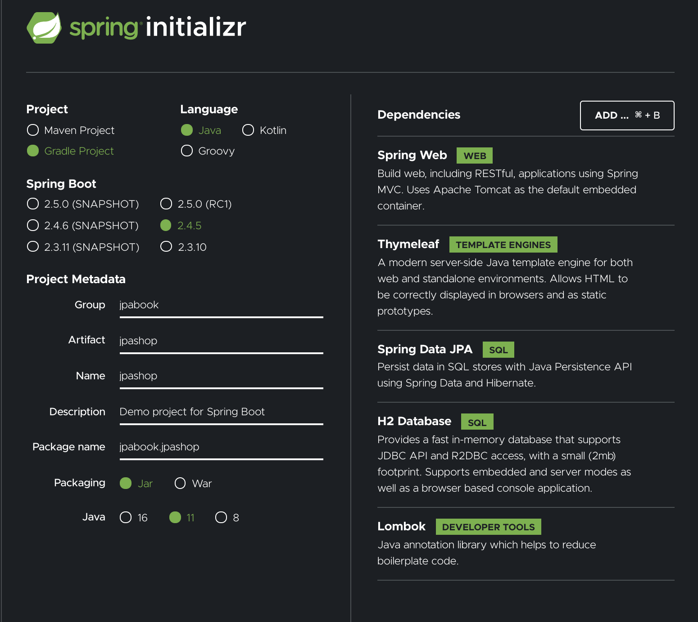

### 프로젝트 생성
  - [스타터 페이지](https://start.spring.io/) 에서 프로젝트 생성 
  
  - application run 후, localhost:8080 접속
  
### 롬복 셋팅 
  - 자주사용하는 코드 (Getter, Setter, 생성자 , toString ...)등을 [어노테이션](./annotation.md)으로 자동생성
  - Prefrences > plugin > lombok 설치
  - Prefrences > Annotation Processors > Enable annotation processing 체크 (재시작)
    
  
      : 프로젝트별 설정 해줘야함
  - 임의의 테스트 클래스를 만들고 @Getter, @Setter 확인
  

  - !! 적용을 했는데도 생성자가 제대로 생성이 안된경우
  ```bash
  error: variable name not initialized in the default constructor private final String name;
  ```
  에는 build.gradle 에서 annotationProcesser을 추가한다 
  ```java
  dependencies {
        annotationProcessor 'org.projectlombok:lombok'
        implementation 'org.projectlombok:lombok'
        testAnnotationProcessor 'org.projectlombok:lombok'
        testImplementation 'org.projectlombok:lombok'
    }
    configurations {
        compileOnly {
            extendsFrom annotationProcessor
        }
    }
  ```

### InteliJ Gradle 대신 자바 직접 실행
  - 기본 설정인 Gradle 로 실행하면 속도가 느림 
  - 자바로 바로 실행해서 실행속도를 높임
  

### maven / Gradle 차이
  참고 [링크](https://mylupin.tistory.com/39)

### thymeleaf 템플릿 엔진 
  레퍼런스 [링크](https://www.thymeleaf.org/)

### 내장 WAS 사용 
  외장 으로 사용하지 않기때문에 서버 변동 (버전 업)이 있을경우에도 무리가 없다.

### 정적 파일 위치 
 js, css , image 등의 정적파일들은 src/main/resources/static 하위에 위치 하여 
url에서는 '/'로 설정 
  - ex) src/main/resources/static/image = (http:도메인/image/...) 